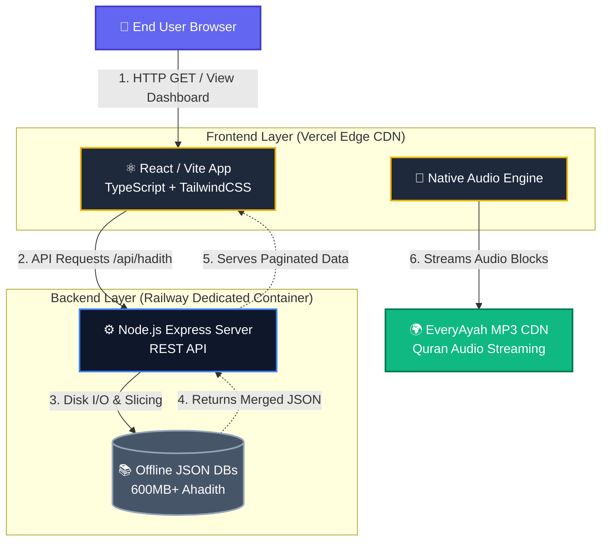

<div align="center">
  
  <br/>
  
  # 🕋 Tafseel-al-Qur'an & Classical Hadith Dashboard
  *A premium, high-performance Islamic Knowledge Dashboard built with React, Vite, and Node.js. Designed to effortlessly serve and search through massive offline Classical Hadith collections and full-length Interactive Quran Recitations.*

  <br/>

  []()
  []()
  []()
  []()

  <br/>
  
  *(📸 **Recommended**: Replace this text with a beautiful screenshot of the dashboard running in dark mode)*

</div>

---

## ✨ Core Features

### 📖 The Classical Hadith Engine
- **Massive Offline Access**: Instantly load and search through hundreds of megabytes of highly compressed, statically hosted JSON data.
- **Major Collections**: Full integration of Sahih al-Bukhari, Sahih Muslim, Sunan Abu Dawud, Jami at-Tirmidhi, Sunan an-Nasai, and Sunan Ibn Majah.
- **Native Tri-lingual Display**: All Hadiths are dynamically cross-referenced on the backend to elegantly display merged English, Arabic, and Urdu datasets simultaneously even when source arrays are missing localized translations.

### 🎧 Interactive Quran Recitation
- **Ayah-by-Ayah Streaming**: Native `HTMLAudioElement` integration allows for flawless, sync-free streaming of individual verses via robust CDN routing.
- **Full Surah Playback**: Seamlessly listen to uninterrupted, full-length surahs with beautiful active-listening UI states.

### 🎨 Breathtaking UI/UX Aesthetics
- **Ultra-Premium "Glassmorphism"**: A stunning dark-mode interface powered by Tailwind CSS.
- **Fluid Micro-Animations**: Orchestrated component rendering utilizing Framer Motion for buttery-smooth dropdowns, pagination states, and network loading transitions.
- **Arabic Typography**: Culturally accurate and elegant serif font stacks optimized specifically for rendering correct Quranic script and Urdu Nastaliq.

---

## 🏗️ Architecture & Component Flowchart

The project utilizes a decoupled client/server architecture to optimize for edge-network CDN caching (frontend) while preserving processing capacity for parsing monolithic JSON database files (backend).



---

## 🚀 Production Deployment Guide

This application must be deployed across two discrete platforms. Serverless environments (like Vercel) have strictly enforced execution timeframes and payload constraints (e.g., 50MB) that will crash when attempting to load the 600MB Hadith databases into memory. Therefore, the backend API requires a persistent container.

### Step 1: Deploy the Node.js Backend (Railway / Render)
1. Push this repository to GitHub.
2. Create a new service in **[Railway](https://railway.app/)** or **[Render](https://render.com/)**.
3. Set your **Root Directory** to `tafseel-al-quran/server`.
4. The deployment engine will automatically detect `package.json` and execute `npm install` and `npm start`.
5. *Wait for compilation.* Once successful, copy the live production URL generated (e.g., `https://tafseel-api.up.railway.app`).

### Step 2: Deploy the React Frontend (Vercel)
Vercel handles the React code perfectly, compiling it to ultra-fast static HTML/JS assets.
1. Create a new project in **[Vercel](https://vercel.com/)** connected to your GitHub repo.
2. Set the **Root Directory** configuration to the `app` folder.
3. Before finalizing the build, go to the **Environment Variables** panel in Vercel:
   - Add `VITE_API_BASE_URL`
   - Set the value to your Railway URL from Step 1, with `/api` appended (e.g., `https://tafseel-api.up.railway.app/api`).
4. **Deploy**. The frontend will automatically route its requests to your live Railway backend. *(Note: The backend CORS policy is pre-configured to accept requests natively from `.vercel.app` domains).*

---

## 🛠️ Local Development

To run the full-stack ecosystem locally, you will need to open two separate terminal instances.

### 1. Booting the Backend Server
```bash
# Navigate to the server folder
cd tafseel-al-quran/server

# Install all Node modules
npm install

# Start the development server (Defaults to Port 5000)
npm run dev
```

### 2. Booting the Frontend Client
```bash
# Open a new terminal window and navigate to the frontend folder
cd app

# Install all React dependencies
npm install

# Start the Vite development server (Defaults to Port 5173)
npm run dev
```

Open your browser to `http://localhost:5173` to interact with the dashboard!

---

## 💳 Tech Stack
- **Frontend Core**: React 18, TypeScript, Vite
- **Styling**: Tailwind CSS, Lucide React (Icons), Framer Motion
- **Architecture**: Zustand (Global Store), Axios
- **Backend Core**: Node.js, Express.js
- **Middleware**: CORS, Helmet, Morgan (HTTP Logging)

---

<div align="center">
  <p>Built with ❤️ and dedication for the Ummah.</p>
</div>
